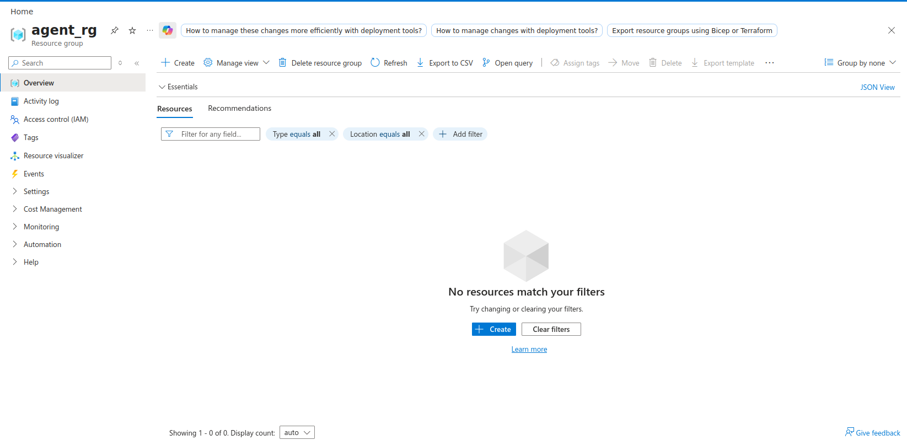
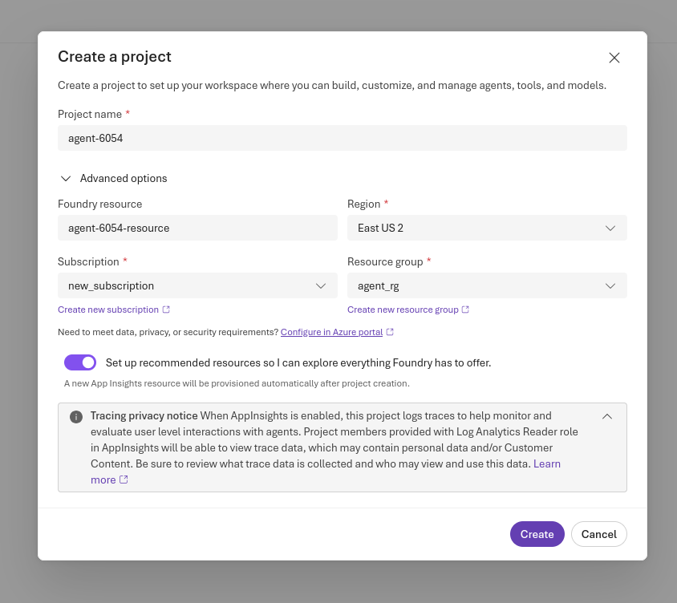
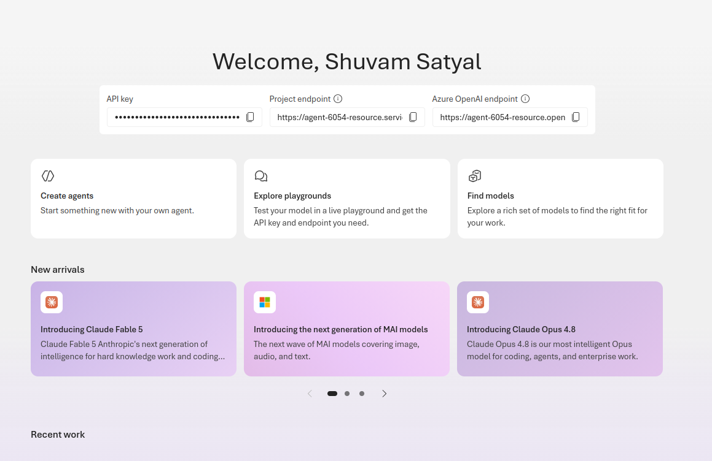
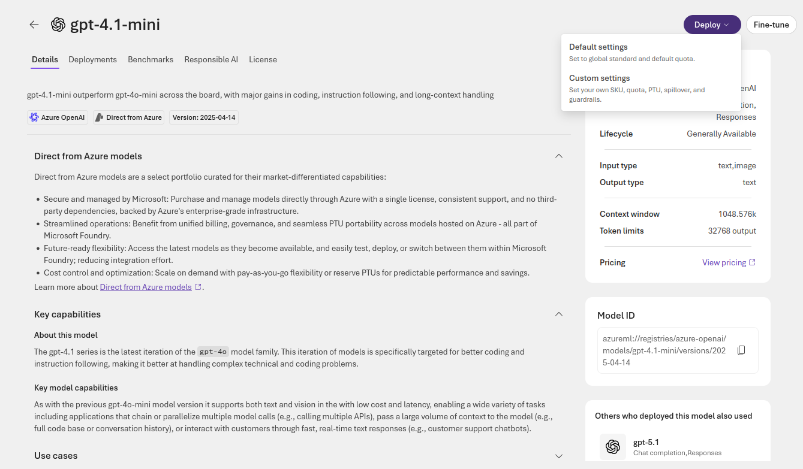
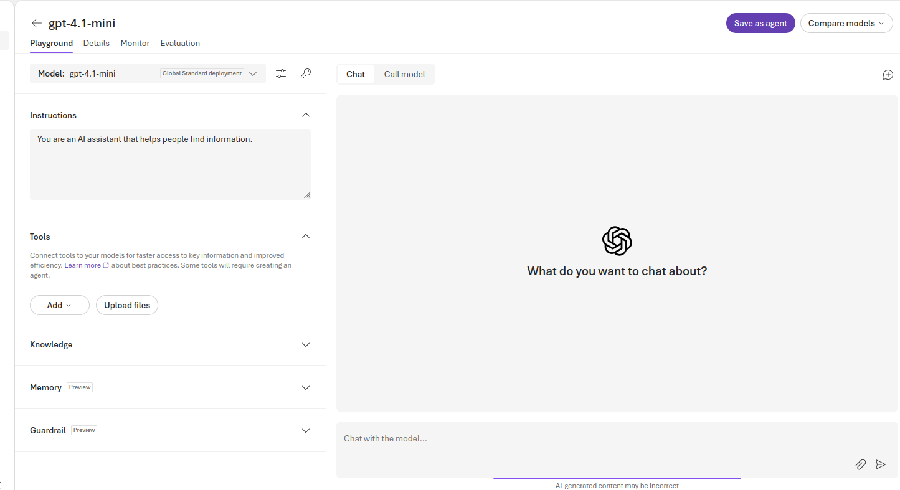
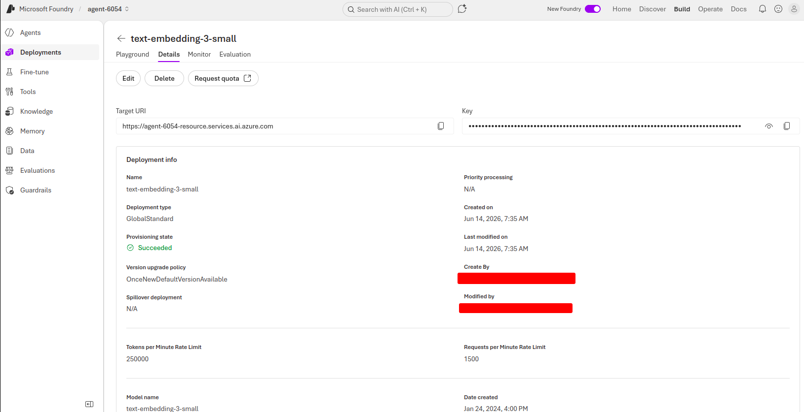

# 01 — Azure AI Foundry Project and Model Deployments

This section creates the main Azure AI Foundry project and deploys the two model types needed for the walkthrough:

* a chat model for agent reasoning and responses
* an embedding model for Azure AI Search vectorization

## Step 1.1 — Create a resource group

* Go to Azure Portal -> Resource groups -> Create.
* Give it a name and choose a region.
* Click on Review + create -> Create.

## Step 1.2 — Create the Azure AI Foundry project

* Go to https://ai.azure.com.
* Sign in with the same Azure subscription used for the resource group.
* Click on Create Project.
* Give it a project name.
* Give it a Foundry resource name.
* Choose the correct region, subscription, and resource group.
* Click on Create.
* This creates a Foundry resource in Azure.

## Step 1.3 — Deploy the chat model

* Open the Azure AI Foundry project.
* Go to Build -> Deployments.
* Click on Deploy a base model.
* Choose a chat model available in your region. I used gpt-4.1-mini for this project.
* Click on Deploy -> Default settings.
* This deploys the model that agents will use to understand questions, reason, and generate responses.

## Step 1.4 — Deploy the embedding model

* Go to Build -> Deployments.
* Click on Deploy a base model.
* Choose an embedding model available in your region. Use text-embedding-3-small if it is available.
* Click on Deploy -> Default settings.
* This deploys the embedding model that Azure AI Search will use later to vectorize the evidence documents.

## Step 1.5 — Confirm both model deployments

* Go to Build -> Deployments.
* Confirm that both deployments are listed:

  1. Chat model deployment: gpt-4.1-mini
  2. Embedding model deployment: text-embedding-3-small
* Make sure both deployments show a successful status.

## Notes

The chat model and embedding model serve different purposes. The chat model is used by the agents to reason and generate answers. The embedding model is used later by Azure AI Search when creating the vectorized RAG index.

