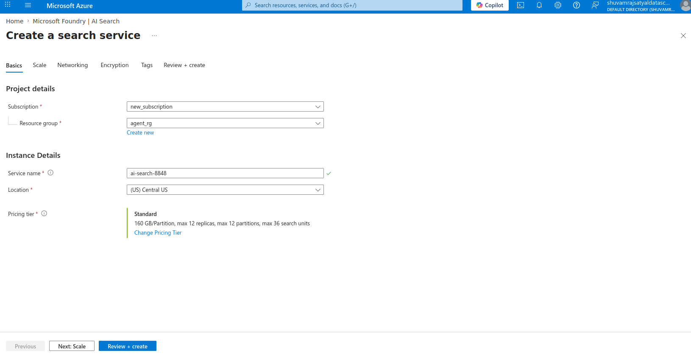
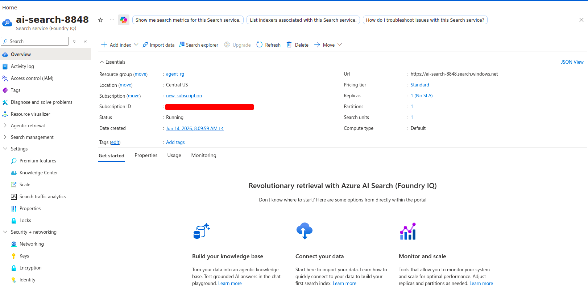
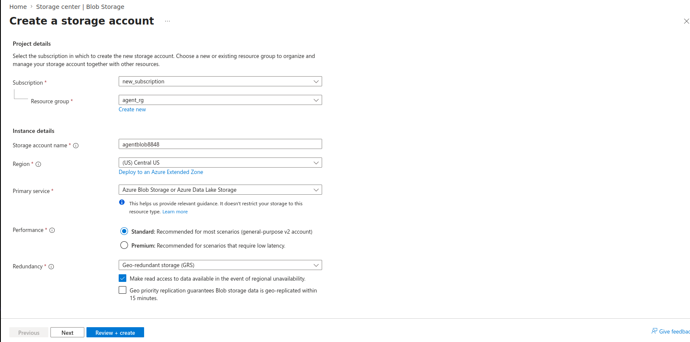
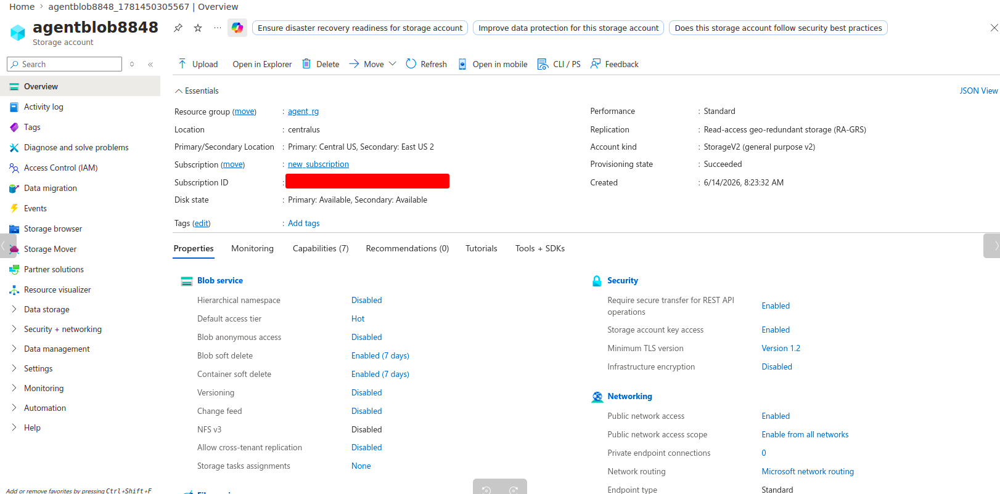
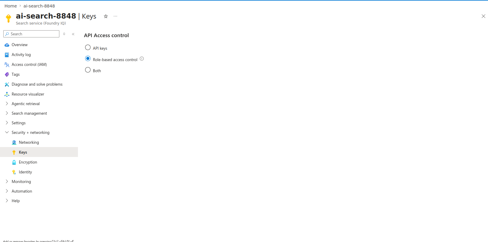

# Storage, Search, and Permissions

This section creates the Azure AI Search service, Storage Account, Blob container, and permissions needed before building the RAG index.

The goal is to prepare the Azure resources so that Azure AI Search can read documents from Blob Storage, use the embedding model for vectorization, and later be connected to Azure AI Foundry.

## Step 2.1 — Create the Azure AI Search service

* Go to Azure Portal.
* Search and click on "AI Search (Foundry IQ)".
* Click on Create.
* Choose the correct subscription and resource group.
* Give the Search service a name.
* Choose a region where the "Standard" pricing tier is available. In my case, the portal selected Central US.
* Click on "Change Pricing Tier" if Standard pricing tier is not selected by default.
* Use the Standard tier because this project needs Azure AI Search for RAG indexing, vector search, and semantic ranking.
* Click Review + create -> Create.
* Wait for deployment to complete and go to the Azure AI Search service.

## Step 2.2 — Create a Storage Account

* Go to Azure Portal -> Storage accounts.
* Click on Create.
* Choose the correct subscription and resource group.
* Give the Storage Account a globally unique name.
* Choose a region. Use the same region as the Search service if available.
* For Primary service, choose "Azure Blob Storage or Azure Data Lake Storage".
* Do not enable "Hierarchical namespace" because ADLS Gen2 features are not needed for this project.
* Keep the default redundancy option.
* Click Review + create -> Create.
* Wait for deployment to complete and go to the Storage Account.
* This creates the storage location where the documents will be uploaded before Azure AI Search indexes them.

## Step 2.3 — Create a Blob container and directory

* In the left menu, go to Data storage -> Containers.
* Click on "Add Container".
* Give the container a name.
* Click Create.
* Open the new container.
* Click on "Add Directory" -> give it a name -> click "Ok".
* This creates a directory inside a private Blob container where documents will be uploaded for Azure AI Search indexing.
* Later, use this same directory name in the Azure AI Search RAG wizard's Blob folder field.

## Step 2.4 — Configure Azure AI Search API access control

* Open the Azure AI Search service created in Step 2.1.
* In the left menu, go to Security + networking -> Keys.
* Find the API Access control and set it to allow role-based access.
* This allows Azure AI Search to work with role-based access control later when it is connected to Azure AI Foundry and used by notebooks.

## Step 2.5 — Enable managed identity for Azure AI Search

* Go to the previously created Azure AI Search service.
* In the left menu, go to Security + networking -> Identity.
* Under System assigned, turn Status to On.
* Click Save.
* This creates a managed identity for the Azure AI Search service so it can be selected in role assignments.

## Step 2.6 — Assign Storage Blob Data Reader to Azure AI Search

* Open the Storage Account created in Step 2.2.
* In the left menu, go to Access control (IAM).
* Click on "Add role assignment".
* Search for and select "Storage Blob Data Reader".
* Click Next.
* For Assign access to, choose Managed identity.
* Click Select members.
* In the managed identity selector, choose the Azure AI Search service created in Step 2.1.
* Click Select.
* Click Review + assign.
* This lets Azure AI Search read the documents from Blob Storage when it later creates the RAG index.

## Step 2.7 — Give Azure AI Search access to the embedding model resource

* Go to Azure Portal and open "All resources".
* Locate the Foundry resource created automatically at the time of Azure AI Foundry project creation. In the "Type" column, look for "Foundry" to locate it and not "Foundry project".
* Go to Access control (IAM).
* Click on Add role assignment.
* Search for and select "Cognitive Services OpenAI User".
* Click Next.
* For Assign access to, choose Managed identity.
* Click Select members.
* In the managed identity selector, choose the Azure AI Search service created in Step 2.1.
* Click Select.
* Click Review + assign.
* This lets Azure AI Search use the embedding model later when the RAG wizard vectorizes the documents.

## Step 2.8 — Give the Foundry project access to Azure AI Search

* Go to Azure Portal.
* Open the Azure AI Search service created in Step 2.1.
* Go to Access control (IAM).
* Click Add role assignment.
* Search for and select "Search Index Data Reader".
* Click Next.
* For Assign access to, choose Managed identity.
* Click Select members.
* In the managed identity selector, choose Foundry project.
* Select the Foundry project created in Step 1.2.
* Click Select.
* Click Review + assign.
* Repeat the same process for "Search Service Contributor".
* This lets the Foundry project access the Azure AI Search index later when the RAG agent uses Search as a connected resource.

## Step 2.9 — Add Azure AI Search as a connected resource in Foundry

* Go to Azure AI Foundry portal.
* Open the project created in Step 1.2.
* Go to Operate -> Admin.
* In "All projects", select the Foundry project created in Step 1.2.
* Go to Connected resources.
* Click Add connection.
* Click on "Azure AI Search" and click on "Continue".
* Select the Azure AI Search service created in Step 2.1.
* For authentication type, choose Project Managed Identity.
* Click Connect.
* This connects Azure AI Search to the Foundry project so agents and notebooks can use the Search index later.

